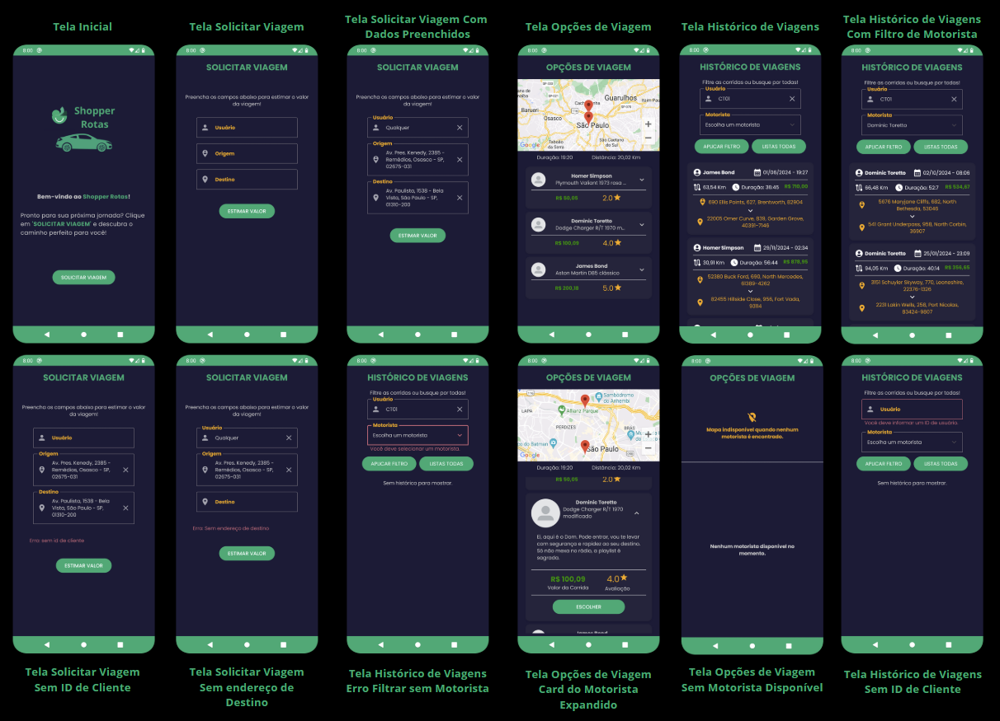

<h1 align="center">
  
Shopper Rotas

## 💻 Project

O Shopper Rotas é um aplicativo desenvolvido para suprir as necessidades impostas no documento Técnico. O objetivo do projeto é criar o frontend de uma aplicação nativa para transporte particular, que interage com uma API simulada para oferecer funcionalidades como solicitação de viagens, seleção de motoristas e histórico de viagens.

</h1>

  
Vídeo de Demonstração

  
https://github.com/user-attachments/assets/05709080-f17c-4449-8978-596d820a87cf

## 🚀 Funcionalidades

Algumas das funcionalidades do aplicativo:

- **Solicitação de viagem:** Permite ao usuário informar o ID, origem e destino, e calcular estimativas;
- **Opções de viagem:** Apresenta motoristas disponíveis com suas avaliações e custos;
- **Histórico de viagens:** Exibe todas as viagens realizadas, com filtros para pesquisa detalhada;
- **Tratamento de erros e feedback:** Garante que o usuário receba mensagens claras em caso de erros e visualizações de progresso;

## 🛠️ Desenvolvimento

O aplicativo foi desenvolvido para a plataforma Android utilizando as seguintes tecnologias e ferramentas:

- `Android Studio (IDE);`
- `Kotlin (Linguagem de Programação);`
- `Jetpack Compose (Layout);`
- `MVVM (Arquitetura);`
- `Hilt (Injeção de Dependências);`
- `JUnit, Mockito (Testes Unitários);`

 
